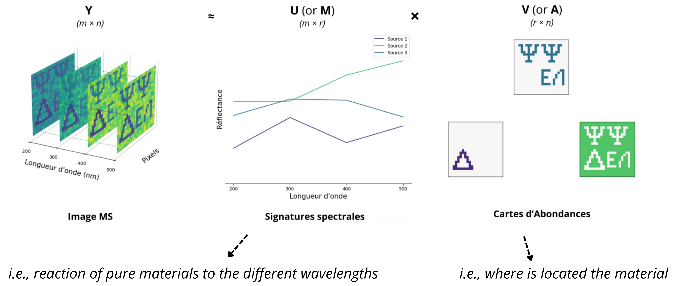

# 🎨 Scientific Visualization & Research Communication

This repository centralizes the data visualization and scientific communication assets developed during my Master's research in **Computer Vision** and **Machine Learning**.

The goal of this portfolio is to demonstrate how mathematical and physical concepts (Matrix Factorization, Multispectral Imaging, Deep Learning Architectures) can be made intelligible through a **visual and programmatic approach**.

## 📂 Repository Contents

### 1. 📜 ICCV 2025 Poster
A synthetic presentation of my research on **Unsupervised Multispectral Image Segmentation**, accepted at the **ICCV 2025 VisionDocs Workshop**.

> *[Click to view the high-resolution file]*

---

### 2. 🎥 Mathematical Animations (Manim)
To bridge the gap between theory and intuition, I developed Python scripts using the **Manim** library to visualize the use of low-rank decomposition methods, such as NMF, applied to Multispectral Images.

| NMF video | NMF static |
|:---:|:---:|
|  |  |

**Key Concept:** How to interpret low-rank decomposition for Multispectral Images.
**Source Code:** [View Python Script](./src/manim_scripts/nmf_viz.py)

---

### 3. 📊 Data Analysis & Figures (Matplotlib/Seaborn)

High-precision figures generated for the Master's thesis, focusing on spectral signature analysis and ablation studies.

**To-do**

---

### 🛠️ Tools & Technologies
* **Core:** Python 3.9+
* **Animation:** Manim Community Edition
* **Plotting:** Matplotlib, Seaborn
* **Design:** LaTeX (Overleaf), Canva Pro

---

### 🔗 Related Research
* 📄[`Link to the paper on IEEE/cvf open access`](https://openaccess.thecvf.com/content/ICCV2025W/VisionDocs/html/Declercq_PRISM_Pruning_for_Rank-adaptive_Interpretable_Segmentation_Model_with_Application_to_ICCVW_2025_paper.html)

